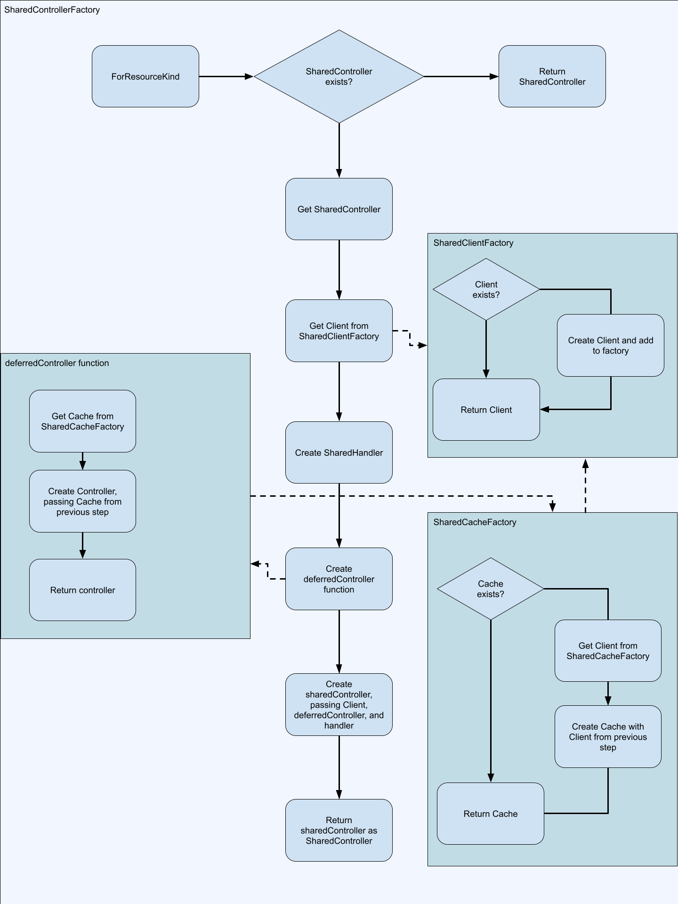

Lasso
=====

# Contents
- [Lasso](#lasso)
- [Contents](#contents)
- [Overview](#overview)
- [Structure of this Document](#structure-of-this-document)
- [Kubernetes Controllers](#kubernetes-controllers)
- [Lasso's Value Proposition](#lassos-value-proposition)
	- [Lasso Controller](#lasso-controller)
	- [Lasso Shared Controller](#lasso-shared-controller)
	- [Lasso Client](#lasso-client)
	- [Lasso Cache](#lasso-cache)
	- [Lasso Shared Cache Factory](#lasso-shared-cache-factory)
	- [Lasso Shared Client Factory](#lasso-shared-client-factory)
	- [Lasso Shared Controller Factory](#lasso-shared-controller-factory)
	- [Deferred Controller Function](#deferred-controller-function)
- [How to use Lasso](#how-to-use-lasso)
- [Credits and Resources](#credits-and-resources)

# Overview
Lasso is a controller framework.

Lasso has some functional parity with the controller-runtime project and could be used in place of controller-runtime.

Lasso is low level. If you want to manage your own controllers then you can use it. If you are looking for more convenience and functionality for creating your own resource types, we recommend checking out [Wrangler](https://github.com/rancher/wrangler).

Core controller framework used by [Wrangler](https://github.com/rancher/wrangler) and [Norman](https://github.com/rancher/norman).

# Structure of this Document
This document was written with two audiences in mind: someone who is new to Kubernetes controllers and someone who is not new to Kubernetes controllers but is new to lasso.

If you fall into the category of "Someone who is not new to Kubernetes controllers" you may skip to [Lasso's Value Proposition](#lassos-value-proposition).

If you are new to Kubernetes controllers, it is recommended you do not skip any sections.

If you are lacking basic Kubernetes knowledge then it is recommended you consult other documentation on the basics first, such as the [Kubernetes Overview](https://kubernetes.io/docs/concepts/overview/).

# Kubernetes Controllers
_Note:_ This will be a very brief crash course. We encourage you to look up other resources regarding the topic, there are many! Two recommended resources are the [Sample Controller Project](https://github.com/kubernetes/sample-controller) and [Introduction To Kubernetes Controller Frameworks](https://github.com/aiyengar2/k8s-docs/blob/main/docs/controllers/03_frameworks.md).

From [the Kubernetes Documentation](https://kubernetes.io/docs/reference/command-line-tools-reference/kube-controller-manager/)
> In Kubernetes, a controller is a control loop that watches the shared state of the cluster through the apiserver and makes changes attempting to move the current state towards the desired state.

The word "controller" get used more loosely than what the above definition might have you believe. In our own words: Controllers are loop handlers that act in response to Kubernetes resource events. In Lasso, we also use the word "controller" to refer to the entire structure that is responsible for registering this loop handler and providing it the resources it needs. In short, controllers are structures that bundle everything necessary to interact with and operate on Kubernetes types.

In order to achieve the above goal, a few sub-goals need to be met:
* the controller needs to know about resource type events
* the controller needs to be passed relevant details regarding the event to a handler
* (optional) the controller __may__ want to interact with Kubernetes resource types

There are many frameworks to help achieve the above goals. Lasso is one of them. What most of these frameworks have in common, including lasso, is that they use functionality from client-go to achieve these goals. You could achieve these goals by using just client-go. For the remainder of this section, we will fly through how a controller is put together just using client-go concepts.

An informer is used to achieve the above goals needed for a Kubernetes Controller. An informer possesses an event handler and an indexer. The indexer possesses a store and map functions for indexing objects within the store called indexers. The underlying structs are different, but a pseudo struct is shown below to illustrate this:

```
Informer
	EventHandler
	Indexer
		Store
		Indexers
```

The EventHandler can have different logic for create, update, and delete events. The event handler is where the controller comes in. You use it to configure the create, update, and delete event handlers.

The indexer is used as a cache.

- The store is where the indexer persists objects.

- The indexers are functions that the indexer can use to index persisted objects. Once indexed with an indexer, objects can be retrieved using strings that describe a characteristic the indexer cares about.

The indexer will often be used to retrieve an object by simple metadata such as namespace and name.

The informer first populates the indexer by listing all resources returned from a client. Then the informer watches the Kubernetes resource it is assigned to. When an event comes through, it uses that event to update its indexer and execute its event handlers.

Usually an application would want multiple controllers. However, it may not be efficient for every controller to have its own informer and therefore its own indexer. The SharedIndexerInformer from client-go can be used to add multiple controllers that all use the same indexers.

There is a great visual of how a Kubernetes controller might work found in the [kubernetes/sample-controller repo](https://github.com/kubernetes/sample-controller/blob/master/docs/images/client-go-controller-interaction.jpeg).

__Note:__ Informers have been simplified for the sake of brevity. If you are interested in exactly how they work it is recommended you read through the [client-go code](https://github.com/kubernetes/client-go).

# Lasso's Value Proposition
### Lasso Controller
Lasso standardizes what a controller is with its controller package. Lasso introduces factories for managing caches, controllers, and clients within a project. This is imperative for rancher which manages many instances of many types.

The lasso controller uses the client-go work queue. Lasso registers an event handler that processes the work queue. The work queue oriented handler makes it so only one event handler needs to be added for each Kubernetes type. Now registering a handler just adds it to the type's controller's list of handlers. Enqueueing an objects adds it to the work queue. Each object in the work queue will then be processed by workers running in goroutines. The controller's event handler will re-enqueue any object that causes one or more of the controller's handlers to return an error that is not of type `ErrIgnore`. This work queue can also have objects enqueued from other sources. This functionality is exposed through the controller's Enqueue function. This transforms controllers from only being reactive to Kubernetes resources and cache re-syncs, to also being invokable by code.

### Lasso Shared Controller
The sharedController type embeds the Controller interface to expose its controller's functionality. The sharedController also exposes the RegisterHandler function along with the Client function. RegisterHandler adds the passed handler to the controller's handler list and Client returns a client for the sharedController corresponding resource type; sharedController has a GVK field (Group Version Kind) which indicates what type it is for.

The "Shared" aspect starts at the more primitive Lasso Controller. The use of a work queue allows one set of Event Handlers to be shared for example. Then the Lasso Shared Controller adds on to this by holding a reusable client for the GVK and adding a way to easily register handlers to the Controller underneath with RegisterHandler.

The sharedController can create its underlying controller. It will only do so once a handler is registered to the sharedController.

### Lasso Client
Wraps Kubernetes client. Contains GVK fields for managing the client in a parent struct such as the sharedClientFactory. Exposes some additional functionality like configuring the User-Agent header for the underlying REST client.

### Lasso Cache
The lasso Cache is a light wrapper around a [SharedIndexInformer from client-go](https://pkg.go.dev/k8s.io/client-go/tools/cache#SharedIndexInformer).

The main benefit of the Lasso Cache is it can be assigned a Cache Factory, which manages SharedIndexInformer in memory by GVK so they can be reused. When using the Lasso Cache functions it will manage itself within the CacheFactory that was passed to create it.

### Lasso Shared Cache Factory
The shared cache factory stores the Caches and allows them to be managed via GVK structs. Once the Caches have been created once they can be reused.

### Lasso Shared Client Factory
The Shared Client Factory exists so that a client for a GVK can be reused after it has been created.

### Lasso Shared Controller Factory
The SharedControllerFactory ties everything above together. It allows for a single entry point to access clients, caches, and handlers- all of which it manages for you. It is possible to mainly interact with the shared controller factory. It will create all the underlying controllers, clients, and caches you need. It will ensure there are not duplicates of these objects. It will prevent race conditions.

Once you use ForObject, ForKind, ForResource, or ForResourceKind, the SharedControllerFactory will do the following:


### Deferred Controller Function

The deferredController is a function that, once executed, will create and return a controller. It will create the controller using a cache from the SharedCacheFactory. The deferredController function's purpose is to hold off on populating the cache until absolutely necessary. This ensures only Kubernetes resources that have registered handlers, been enqueued, or have had their controller's cache requested, are being stored in memory.

When you get a sharedController from the SharedControllerFactory, it won't have an underlying Controller instantiated yet. It will instead called the deferredController method to create one once one of the mentioned operations are performed.

# How to use Lasso
Below are the steps for a straightforward way to register handlers and run them in lasso:
1. Create rest config pointing to your target cluster. A common way of doing this will be shown in example code below.
2. Register the types you need to a scheme. This is for client-go. If you would like to know more about client-go's scheme package, checkout the [docs](https://pkg.go.dev/k8s.io/client-go/kubernetes/scheme).
3. Create the SharedControllerFactory. There are a few ways to do this. The most straightforward, ready out of the box, way to create a SharedControllerFactory is to use NewSharedControllerFactoryFromConfig. You will need to pass the rest config from step 1.
4. Get the controller from your SharedControllerFactory for the Kubernetes resource type you want to register a handler to. Use ForObject, ForKind, ForResource, or ForResourceKind to achieve this.
5. Register the handler with the controller retrieved in step 2 using the RegisterHandler function.
6. Go back to step 2 until you have registered all the handlers you would like.
7. Use SharedControllerFactory's Start function. It is worth noting that the "workers" parameter dictates how many workers will be used _per_ controller to process items in the work queue.

```go
package main

import (
	"context"

	"github.com/rancher/lasso/pkg/controller"
	appsv1 "k8s.io/api/apps/v1"
	metav1 "k8s.io/apimachinery/pkg/apis/meta/v1"
	"k8s.io/apimachinery/pkg/runtime"
	"k8s.io/client-go/rest"
)

func main() {
	config, err := clientcmd.BuildConfigFromFlags("", os.Getenv("KUBECONFIG"))
	if err != nil {
		panic(err)
	}

	// Setup types you want to work with
	scheme := runtime.NewScheme()
	appsv1.AddToScheme(scheme)

	controllerFactory, err := controller.NewSharedControllerFactoryFromConfig(config, scheme)
	if err != nil {
		panic(err)
	}

	// ForObject, ForKind, ForResource, and ForResourceKind can all be used to retrieve the controller.
	// They all accept different parameters but the first three all eventually call ForResourceKind.
	// Refer to [How to use Lasso](#how-to-use-lasso) for more information on how ForResourceKind works.
	sharedController, err := controllerFactory.ForObject(&appsv1.Deployment{})
	if err != nil {
		panic(err)
	}

	// Register a handler on a shared controller. If you need a dedicated queue then use controller.New()
	sharedController.RegisterHandler(context.TODO(), "my-handler", controller.SharedControllerHandlerFunc(func(key string, obj runtime.Object) (runtime.Object, error) {
		// obj is the latest version of this obj in the cache and MAY BE NIL when an object is finally deleted
		dep, ok := obj.(*appsv1.Deployment)
		if !ok {
			return obj, nil
		}

		// Do some stuff ...

		// Get stuff from the cache
		sharedController.Informer().GetStore().Get(key)

		result := &appsv1.Deployment{}
		err := sharedController.Client().Update(ctx, dep.Namespace, dep, result, metav1.UpdateOptions{})

		// return the latest version of the object
		return result, err
	}))

	// the second, int parameter is the number of workers to be used for EACH controller.
	err = controllerFactory.Start(context.TODO(), 5)
	if err != nil {
		panic(err)
	}
}

```

# Credits and Resources
The following resources were helpful in writing these docs. They are highly recommended for learning more than what is presented here:
1. [the Kubernetes Documentation](https://kubernetes.io/docs/reference/command-line-tools-reference/kube-controller-manager/)
2. https://docs.bitnami.com/tutorials/a-deep-dive-into-kubernetes-controllers/
3. https://aly.arriqaaq.com/kubernetes-informers/
4. https://github.com/kubernetes/sample-controller/blob/master/docs/controller-client-go.md
